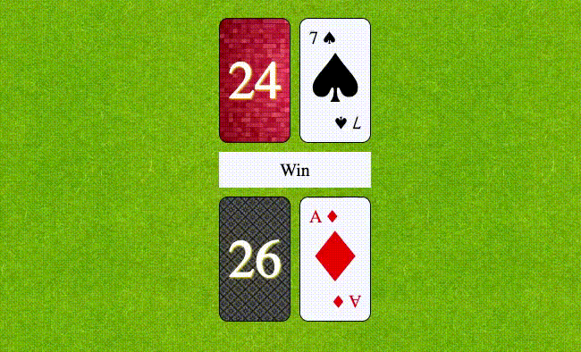

# War Card Game JS Animation

# CSS
- ::before / ::after pseudo elements

# Javascript
- create Deck class (reusable code) JS OOP
- created deck of cards array based on suits and values rather than arbitrary 52count
- push() / pop()

- traverse DOM with document.querySelector()

- addEventListener("click",) to show each new round and startGame()

- map() / flatMap() to assemble new decks

